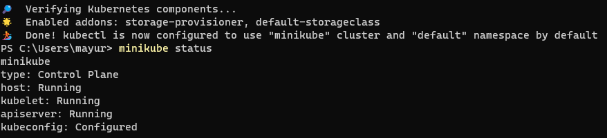
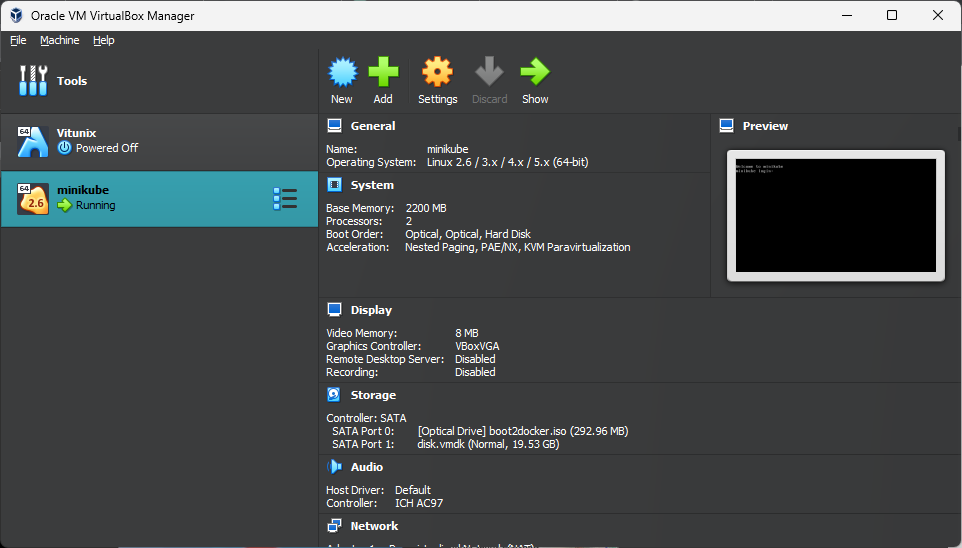

# Minikube

## Let's start the minikube <a href="#lets-start-the-minikube" id="lets-start-the-minikube"></a>

Command:

```
minikube start --driver=<virtual machine name>
```

### For Virtualbox:

```
minikube start --driver=virtualbox --no-vtx-check

// Personal Configurations
minikube start --driver=virtualbox --memory 4000 --cpus 4 --no-vtx-check
```

### For Docker

Enable  and restart the docker

<figure><figcaption></figcaption></figure>

```
minikube start --driver=docker
```

### For Hyper-v, hyperkit, parallels, vmware

Enable the Kubernetes in respective your platform and follow the below command

```
minikube start --driver=hyperv
minikube start --driver=hyperkit
minikube start --driver=parallels
minikube start --driver=vmware
```

After Installation check the status:

```
minikube status
```

<figure><figcaption></figcaption></figure>

<figure><figcaption></figcaption></figure>

That's it, a single node cluster is successfully created in your machine.
