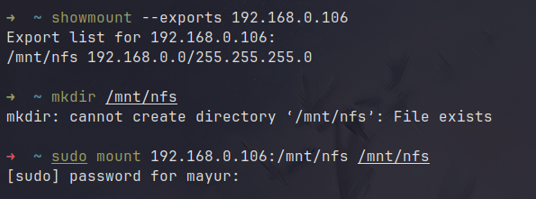

# NFS Server

## Install NFS Server

### Step 1: Install nfs-kernel on the ubuntu

```
sudo apt update
```

```
sudo apt install nfs-kernel-server
```

<figure><figcaption></figcaption></figure>

### Step 2: Create an nfs repository

Create a nfs folder

```
mkdir /mnt/nfs
```

To enable access for all client machines to the shared directory, eliminate any constraints within the directory permissions.

```
sudo chown -R nobody:nogroup /mnt/nfs
```

You can also tweak the file permissions to your preference. Here’s we have given the read, write and execute privileges to all the contents inside the directory.

```
sudo chmod 777 /mnt/nfs/
```

<figure><figcaption></figcaption></figure>

### Step 3: Grant nfs directory access to clients

To allow access for all client machines to the shared directory, remove any existing restrictions in the directory permissions.

```
sudo mv /etc/exports /etc/exports.orig
```

Create a new file

```
sudo vi /etc/exports
```

Add the following content in /etc/exports file

```
/mnt/nfs  192.168.0.0/24(rw,sync,no_subtree_check)
```

<figure><figcaption></figcaption></figure>

### Step 4: Export the nfs directory

After granting access to the preferred client systems, export the NFS share directory and restart the NFS kernel server for the changes to come into effect.

```
sudo exportfs -arv
sudo systemctl restart nfs-kernel-server
```

<figure><figcaption></figcaption></figure>


## Install the NFS Client on the Client Systems

### Step 1: Install basic packages

Update the system

```
sudo apt update
```

Install nfs-common packages

```
sudo apt install nfs-common
```

###

### **Step 2: Create an NFS Mount Point on Client**

```
sudo mkdir -p /mnt/nfs
```

###

### **Step 3: Mount NFS Share on Client System**

To check if the server is exporting any directories, use the following command.

```
showmount --export <server_ip_addr>
```

Now mount the nfs directory to your directory

```
sudo mount <ip_add>:/mnt/nfs /mnt/nfs
```

<figure><figcaption></figcaption></figure>

### Step 4: Check the connection.

Add some files on server side.

```
cd /mnt/nfs
```

```
vim test1.txt
```

Now, verify the presence of the files on the client side.

```
ls -l /mnt/nfs
```

<figure><figcaption></figcaption></figure>

## Installing Autofs

Autofs offers automounting functionality, automatically mounting the NFS directory when accessed.

### Step 1: Un-mount the nfs directory

```
sudo umount /mnt/nfs
```


### Step 2: Install autofs on your system

```
sudo apt install autofs // for debian system
sudo pacman -S autofs // For arch system
```

<figure><figcaption></figcaption></figure>

### Step 3: Autofs Configurations

Edit the file '_<mark style="color:blue;">/etc/autofs.master</mark>_' or '_<mark style="color:blue;">/etc/autofs/autofs.master</mark>_' and add the following content.

```
/mnt/nfs /etc/autofs/autofs.nfs --ghost --timeout=60
```

Create the file '_<mark style="color:blue;">/etc/autofs/autofs.nfs</mark>_' or '_<mark style="color:blue;">/etc/autofs.nfs'</mark>_. Additionally, establish a 'backups' folder on the server side.

```
backups -fstype=nfs4,rw 192.168.0.106:/mnt/nfs
```

<figure><figcaption></figcaption></figure>

Delete all mount points and restart the autofs service.

<figure><figcaption></figcaption></figure>

Check whether the NFS server is mounted or not.

<figure><figcaption></figcaption></figure>

The NFS server is currently not mounted. Now attempt to access the NFS directory.

<figure><figcaption></figcaption></figure>

The NFS server is now accessible, and it is mounted automatically when accessed.


## Source / Documentation&#x20;






