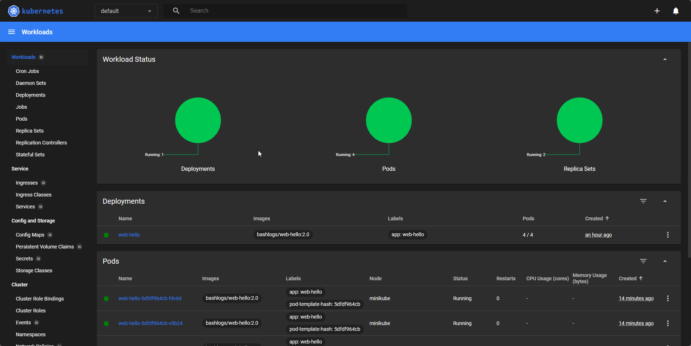

# Kubernetes Dashboard

### To launch kubernetes dashboard

```
minikube dashboard
```

<figure><figcaption></figcaption></figure>

you can check status, information about everything we have learn until now in this kubernetes dashboard

