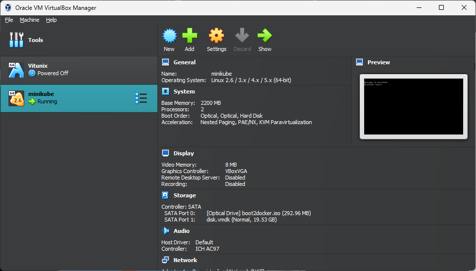

# Cluster Setup

### Let's start the minikube

Command:&#x20;

```
minikube start --driver=<virtual machine name>
```

For Virtualbox:&#x20;

```
minikube start --driver=virtualbox --no-vtx-check
```

For Hyper-v, hyperkit, parallels, vmware

```
minikube start --driver=hyperv
minikube start --driver=hyperkit
minikube start --driver=parallels
minikube start --driver=vmware
```

After Installation check the status:

```
minikube status
```

<figure><figcaption></figcaption></figure>

<figure><figcaption></figcaption></figure>

That's it, a single node cluster is successfully created in your machine.
