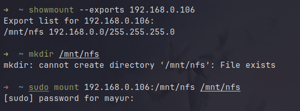

# Config Maps and Secrets

## Config Maps

* **Purpose:** To store non-sensitive configuration data, such as environment variables, configuration files, or command-line arguments.
* **Use Case:** ConfigMaps help in separating configuration from application code, making it easier to update configurations without modifying the application itself.
* **Benefits:** Centralized management of configuration data, easy updates without changing application code, and better portability across different environments.




```yaml
apiVersion: v1
kind: ConfigMap
metadata:
  name: nginx-cm
data:
  # key: value
  nginx.conf: |
    user nginx;
    worker_processes 1;
    events {
      worker_connections  10240;
    }
    http {
      server {
        listen       80;
        server_name  _;
        location / {
          root   /usr/share/nginx/html;
          index  index.html index.htm;
        }
        location /test {
          return 401;
        }
      }
    }

```



```yaml
apiVersion: apps/v1
kind: Deployment
metadata:
  name: nginx-http
spec:
  selector:
    matchLabels:
      app: nginx-http
  template:
    metadata:
      labels:
        app: nginx-http
    spec:
      containers:
      - name: nginx-http
        image: nginx
        resources:
          limits:
            memory: "128Mi"
            cpu: "500m"
        ports:
        - name: web
          containerPort: 80
        volumeMounts:
        - name: nginx-cm
          mountPath: /etc/nginx
        - name: nginx-http-vol
          mountPath: /usr/share/nginx/html
      volumes:
      - name: nginx-cm
        configMap:
          name: nginx-cm
      - name: nginx-http-vol
        hostPath:
          path: /var/nginxserver
```



Run nginx-cm.yml file first and the run the nginx.deploy.yml file

```
kubectl apply -f .\configMaps\nginx-cm.yml
kubectl apply -f .\configMaps\nginx-deploy.yml
```

<figure><figcaption></figcaption></figure>

We can go inside the file and see if the configuration applied or not

```yaml
Command - kubectl exec -it <pod_name> -- /bin/bash
```

<figure><figcaption></figcaption></figure>

Let's see if the configuration successfully applied or not by creating service for nginx


```yaml
apiVersion: v1
kind: Service
metadata:
  name: nginx-http-svc
  labels:
    app: nginx-http
spec:
  type: LoadBalancer
  ports:
  - port: 30080
    targetPort: 80
    protocol: TCP
    name: http
  selector:
    app: nginx-http
```


<figure><figcaption></figcaption></figure>

Now go inside the container and create a index.html file and add some content.

```
Commands:

kubectl exec -it nginx-http-7874b58dbc-vnm2n -- /bin/bash

# To install vim:
    apt-get update && apt-get install vim curl -y 

cd /usr/share/nginx/html/
vi index.html
```

<figure><figcaption></figcaption></figure>

Both configuration applied to the pods.\
First directly access to the index.html file and second 401 error

<figure><figcaption></figcaption></figure>

<figure><figcaption></figcaption></figure>

## Secrets

* **Purpose:** To store sensitive information like passwords, API keys, or any confidential data.
* **Use Case:** Secrets provide a secure way to handle sensitive data, ensuring that it is not exposed in the container images or configuration files.
* **Benefits:** Enhanced security by isolating sensitive information, easy updates without changing application code, and support for various sources like environment variables or mounted volumes.

The secrets work like the config maps but the values inside the secrets are obfuscated with the base64.&#x20;

Secrets can be used to store password, tokens, certificates etc.



```yaml
apiVersion: apps/v1
kind: Deployment
metadata:
  name: mysql
spec:
  selector:
    matchLabels:
      app: mysql
  template:
    metadata:
      labels:
        app: mysql
    spec:
      containers:
      - name: mysql
        image: mysql:5.6
        env:
        - name: MYSQL_ROOT_PASSWORD
          valueFrom:
            secretKeyRef:
              name: mysql-secret
              key: root-pass
        resources:
          limits:
            memory: "128Mi"
            cpu: "500m"

        ports:
        - containerPort: 3306

```



```yaml
apiVersion: v1
kind: Secret
metadata:
  name: mysql-secret
type: Opaque
stringData:
  root-pass: test123

```



Run both the files

```
kubectl apply -f .\configMaps\mysql-secret.yml
```

<figure><figcaption></figcaption></figure>

To Edit the secret file

```
kubectl edit secrets mysql-secret
```

Now the mysql-deploy file

```
kubectl apply -f .\configMaps\mysql-deploy.yml
```

Now to check if the password is successfully applied or not go inside the pod

```
kubectl exec -it mysql-7b9465b6cb-wn7zb -- /bin/bash
```

<figure><figcaption></figcaption></figure>


